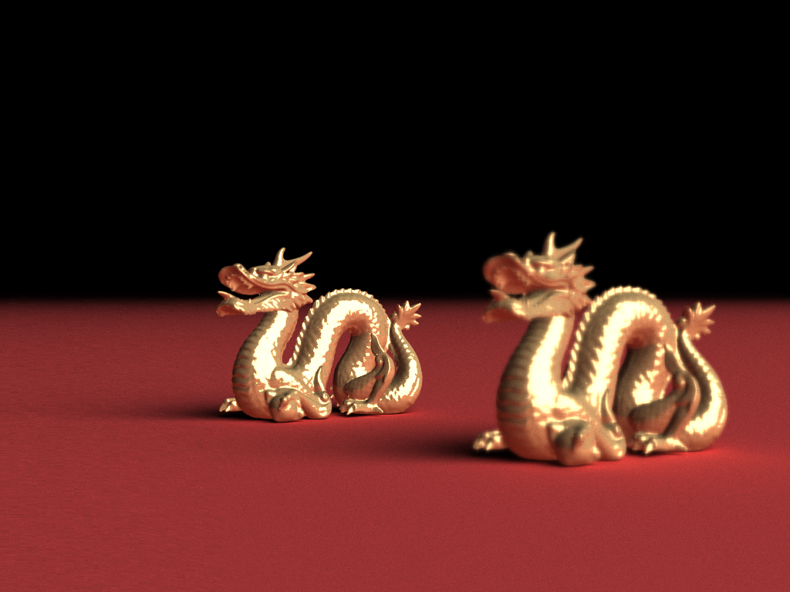

## 真实感图形渲染报告

陈新 2018013443

### 1 代码设计框架

大部分沿用几次PA小作业的框架

 

**Vecmath**：沿用PA1的vecmath，并且为增加精度，将float改为double，故包括`Vector2d`, `Vector3d.h`, `Vector4d.h`, `Quat4d.h`, `Matrix2d.h`, `Matrix3d.h`, `Matrix4d.h`

`Scene_paser.h`：沿用PA1的paser并作出一定修改以适应新的光照模型，从文件读入场景信息。

`Image.h`：沿用PA的image

`basicStruct.h`：定义了一些结构体

`function.h`：定义了一些通用函数，包括随机数等

`camera.hpp`：相机类，记录坐标、方向等参数，产生视线和景深、4x抗锯齿等特效

`ray.hpp`：相机的视角射线

`hit.hpp`：撞击点，在PA1的基础上增添了返回object

`material.hpp`：材质，在PA1的基础上增添了贴图算法

`PathTracing.h`：定义了path tracing的主要算法

 

**Object**

`Object3d.hpp/Group.hpp/Triangle.hpp`：分别是object的虚类、物体元素的group组合体、三角形面片，沿用自PA1，未做大的修改

`Plane.hpp`：平面类，增添了贴图

`Sphere.hpp`：球类，增添了贴图

`Mesh.hpp`：三角面片组形成的模型，用到了包围盒+八叉树求交加速

`Curve.hpp`：2Dbezier曲线类，记录控制顶点、计算Pt/dPt/bernstein多项式等功能

`Revsurface.hpp`：由2Dbezier曲线旋转而来的3D曲面

`Transform.hpp`：变换类，对PA1的transform进行了一定的修改：由于之前的ray光线的transform

 

其中部分以往PA的代码包含在项目中，但未使用到，如`light.hpp`等，为了代码读入的鲁棒性并未删除。故不对这部分代码做解释。

 

### 2 算法选型

**Path tracing**，非单点光源，使用sphere/plane/triangle等定义的发光的object光源。

优点：

**Color bleeding**，当物体镜面反射系数与漫反射系数都在(0,1)时，会一定程度上将反射面的颜色混入物体原色中。例如下图的龙，原色为金色，部分朝下的面片映上了地面的红色

**软阴影**，Path tracing算法的单个像素颜色是由多次射线叠加计算的结果，自动实现了软阴影。

 

 

### 3 实现功能（得分点）

**图片详见目录下的bmp位图**

##### 1 光线追踪、软阴影

上文已经说明，path tracing的算法特性使得软阴影在“多次光线取均值”的情况下自动实现了。

 

PT算法：

物体的漫反射系数$diffusionRate$、镜面反射系数$specularRate$、折射系数$refractRate$满足：

$$
diffusionRate + specularRate + refractRate = 1
$$
对于某一条相机视线ray来说，撞击到物体也相应地将后续光线分为3部分：

（1）   漫反射，在ray撞击物体点的法向半球（即上表面）随机选择一个方向反射

（2）   镜面反射，根据公式：

$$
ReflectDir = Lx – (2 * Lx·N)*N
$$
计算出反射光线的方向

（3）   透射，根据折射定律计算出折射方向

$$
\frac {sin \theta_1} {sin \theta_2} = \frac {n_2} {n_1}
$$
其中，若同时具有镜面反射与折射，则采用轮盘赌的形式决定反射与折射的选择

$$
\begin{aligned}
finalColor \ += \ & diffusionRate * objectColor * computePathTracing(diffuseDirection) + \\

			& specularRate * objectColor * computePathTracing(reflectDirection) + \\

			& refractRate* objectColor * computePathTracing(refractDirection)
\end{aligned}
$$

主要实现在PathTracing.h和PathTracing.cpp中，也包括其余的各类object求交函数intersect等

 

三个球形在正方体空间内部，上方是光源；前方是一面镜子，反射了后方的贴图材质；左球是贴图，中间的球是完美镜面反射，右球是折射。可以看出球下方的软阴影

 

##### 2 景深、抗锯齿

抗锯齿很简单，原本4个sample光线均从同一像素发射，现在在周边均匀选择4个点分别发射1次光线，总量不变，但由于光线与物体交点有细微的差别，取均值之后能够使得物体轮廓与变化更加平滑。

抗锯齿实现在`main.cpp`中的line64前后，和`camera.hpp`中的line107-115

 

相机模型是从一个中心坐标向各面前的虚拟投影屏发射射线，但为了能够看到一些遮挡物背后的景象的同时保持画面大小比例，故增添了一个$canvasDistance$。每次发出光线的出发点都是从射线与距离origin有$canvasDistance$距离的垂直平面的交点发出。

在此基础上扩展景深。设置一个额外的参数$focusDistance$（即焦距），原先的相机模型会产生一条光线，它与焦平面的交点保持不变；然后将相机的center在与焦平面平行的平面上做一个半径为$interfereRatio$（扰动系数是可调整的，越大则景深表现地约明显）的圆，在这个圆内随机选择新的origin。新origin与之前算出的焦平面交点的连线即为$direction$，连线与$canvas$的交点即为光线发生点。

景深实现在`camera.hpp`中的$getInterfere$函数line78-104，和$generateRay$函数中的line126-129

 

可以看出龙的原色是金色，而腰腹部等法向朝下的面片均有color bleeding的效果，混合了地面的红色，映成橘红色。

同时将焦平面设置在后面的dragon模型上，明显看出后龙的清晰度远高于前龙。

 

##### 3 贴图

实现了平面（plane）、球形（sphere）、bezier曲线（revsurface）三种物体的贴图。

 

平面的贴图实现在`plane.hpp`的getTextureColor函数中，line76-82

目前对平面贴图的方向、定位等都是随机的，随机选定平面中一对基向量，随机选择平面中一点作为原点，以此能够写出平面上每一点基于基向量与原点的xy坐标。将这个坐标拿去用`material.hpp`中的getTexture_xy取图片的像素色彩（line52-66）。如此计算出来的贴图并未锚定固定点、图片的四个角落，所以每次运行都是随机的

 

球和bezier曲面的贴图都用到了material.hpp中的getTexture_uv函数，line41-51，将图片压缩至[0, 1][0, 1]的正方形内部，然后根据计算得来的uv坐标取点。

 

球的uv坐标计算为：

$$
\begin{aligned}
\phi &= atan2(z,x) \\
\theta &= asin(y) \\
u &= 1- \frac {\phi + \pi} {2\pi} \\
v &= \frac {\theta + \pi / 2}{\pi}
\end{aligned}
$$
见sphere.hpp的getTextureColor函数，line72-79

 

Bezier曲面的贴图uv坐标计算为：

$$
\begin{aligned}
u &= \frac {\theta}{2\pi} \\
v &= u_{bezier}
\end{aligned}
$$
 

贴图的图片与解释详见上文

 

##### 4 参数曲面解析法

参数曲面外部设置了一个包围盒，减少不必要的相交计算。

 

计算部分，采取习题课讲解的公式计算P(u)和P’(u)，见`curve.hpp`的line76-122

最后并且使用牛顿迭代法逼近解，见`revsurface.hpp`的line149-221

 

若记xy平面内的2Dbezier参数曲线坐标与射线点坐标分别为：

$$
P(u) = 	
\begin{bmatrix}
P_x(u) \\
P_y(u) \\
0
\end{bmatrix}
$$

$$
L(t)=rayOrigin+t*rayDirection =
\begin{bmatrix}
rayO_x + t*rayD_x \\
rayO_y + t*rayD_y \\
rayO_z + t*rayD_z \\
\end{bmatrix}
$$

绕z轴旋转$\theta$角，则曲线旋转后的点坐标为：

$$
S(u,\theta) = 	
\begin{bmatrix}
P_x(u)cos\theta \\
P_y(u) \\
-P_x(u)sin\theta
\end{bmatrix}
$$
记函数：
$$
F(t,u,\theta) = L(t) - S(u,\theta)
$$
则：
$$
\frac {\partial F(t,u,\theta)} {\partial (t,u,\theta)} = 	
\begin{bmatrix}
rayD_x 	& -P'_x(u)cos\theta 	& P_x(u)sin\theta \\
rayD_y 	& -P'_y(u) 				& 0 \\
rayD_z 	& P_x(u)sin\theta 		& P_x(u)cos\theta \\
\end{bmatrix}
$$

$$
x(t,u,\theta) = 
x(t,u,\theta) - 
{\frac {\partial F(t,u,\theta)} {\partial (t,u,\theta)}}^{-1} *
F(t,u,\theta)
$$

最终效果如下（采样率很低的单物体图片，仅作对比使用）：

左图将曲面划分为三角面片模型绘制，明显看出有分界线；右图为用上述公式计算的平滑曲线，没有明显的分界线

 

##### 5 光线求交加速

bezier参数曲面以及mesh的外部都设置了一个长方体包围盒，减少不必要的相交计算。见revsurface.hpp的line75-131

 

mesh外也设置了一个长方体包围盒。在此包围盒中对三角面片进行空间八叉树octree划分，划分直至子树内部的triangle个数小于一个阈值则停止划分。

添加每个划分空间的包围盒的代码：`mesh.cpp`的processBounding函数，line280-329

建八叉树部分的代码：`mesh.cpp`的separate函数，line128-234

 

对每个包围盒6个面计算交点，若交点在长方体体积内部则说明与包围盒有交点，则对8个子结点都求交；若无交点，则退出；对叶节点的求交则是遍历叶节点内所有的triangle。

 

1024*768分辨率、3000sample的两条dragon的图（见上文红色地面图），在加速后能够以个人PC (i9-8950HK, GTX1080-maxq) 的性能在40分钟内渲染完毕。

 

### 4 参考资料

98行的Smallpt，http://www.kevinbeason.com/smallpt/